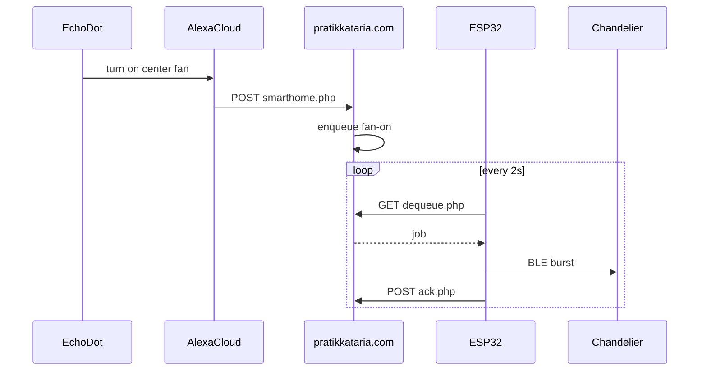

# Jingyuan fan/lamp BLE

Replay `com.jingyuan.fan-lamp` BLE advertisement bursts. ESP32 (or Mac bridge) polls a HTTPS command queue on pratikkataria.com; Alexa Smart Home skill enqueues commands.

Copyright (c) 2026 Pratik Kataria. All rights reserved. See [LICENSE](LICENSE).

## CLI

```bash
cd jingyuan-fan-lamp
python3 fan_ble.py fan-on
python3 fan_ble.py fan-off
python3 fan_ble.py light-on
python3 fan_ble.py light-off
```

Quit the iPhone app before sending commands.

## Mac bridge

### Install

```bash
cp config.example.py config.local.py
# Edit WEBHOOK_TOKEN, QUEUE_DEQUEUE_TOKEN (from deploy script)
chmod +x install.sh uninstall.sh fan_ble.swift scripts/deploy-fan-queue.sh
./scripts/deploy-fan-queue.sh
./install.sh
```

Runs at login via LaunchAgent: `caffeinate -ims bridge_server.py`

### Verify

```bash
curl http://127.0.0.1:8787/health
curl -H "Authorization: Bearer <WEBHOOK_TOKEN>" -X POST http://127.0.0.1:8787/fan/on
curl https://pratikkataria.com/home-automation/fan-queue/health.php
```

### Mac sleep / lid closed

- Plug into power
- System Settings → Battery (Power Adapter) → prevent sleep when display is off
- Optional: `sudo pmset -c sleep 0 disksleep 0`
- Allow **Bluetooth** for Python/Terminal when macOS prompts
- If Mac is asleep, commands queue on hosting and run when Mac wakes

### Uninstall

```bash
./uninstall.sh
./uninstall.sh --purge
```

## Architecture



- **Webhook** (port 8787): local Bearer token; curl/debug
- **Queue poller**: pulls hosting queue when `QUEUE_ENABLED = True`

## Alexa

Smart Home devices **Center Fan** and **Center Light**:

- *"Alexa, turn on center fan"*
- *"Alexa, turn off center light"*

Setup: [`alexa-skill/README.md`](alexa-skill/README.md)

## Deploy queue to hosting

```bash
./scripts/deploy-fan-queue.sh
```

Creates `config.local.php` on server with random tokens on first run. Copy `DEQUEUE_TOKEN` into Mac `config.local.py`.

Manual enqueue test:

```bash
curl -H "Authorization: Bearer <ENQUEUE_TOKEN>" \
  -H "Content-Type: application/json" \
  -d '{"command":"fan-on"}' \
  https://pratikkataria.com/home-automation/fan-queue/enqueue.php
```

## Platform support

| Platform | Backend |
|----------|---------|
| macOS | `fan_ble.swift` via Python |
| Linux / Pi | BlueZ via `dbus-next` |

Linux: `pip install -r requirements-linux.txt` then `sudo python3 fan_ble.py fan-on`

## Protocol

| Command | Type A marker (word 2) | Device hint (word 8) |
|---------|-------------------------|----------------------|
| Fan ON  | `FEFD` | `EC92` |
| Fan OFF | `FFFD` | `EA92` |
| Light ON  | `FEFD` | `EAB2` |
| Light OFF | `FFFD` | `EAB2` |

## Files

| File | Role |
|------|------|
| `protocol.py` | BLE payloads |
| `bridge_server.py` | Webhook + queue poller daemon |
| `queue_poller.py` | Hosting queue poll/ack loop |
| `hosting/fan-queue/` | PHP queue API on pratikkataria.com |
| `alexa-skill/` | Smart Home manifest + setup docs |
| `fan_ble.py` | CLI |
| `install.sh` | LaunchAgent setup |
